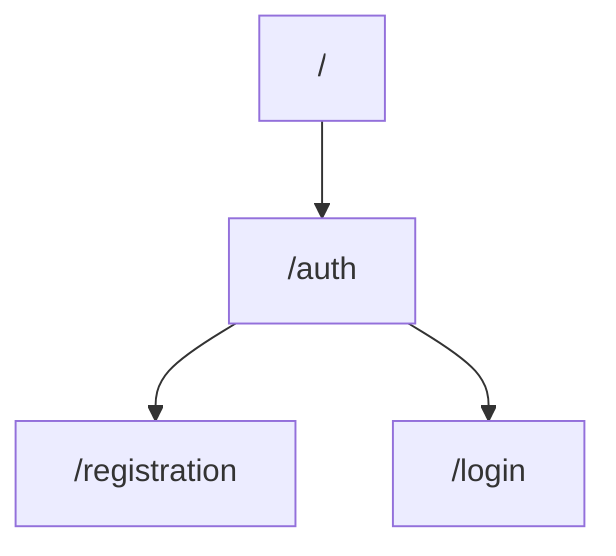

# About

This is a backend REST-API authentication and authorization template written on NestJS.

## Files

After pull, please, make sure you have **.env** file with this content:

|FIELD|VALUE|
|----------------|-------------------------------|
|POSTGRES_HOST|`DB host`            |
|POSTGRES_PORT|`DB port`            |
|POSTGRES_USER|`DB username`|
|POSTGRES_PASSWORD|`DB password`|
|POSTGRES_DB|`DB name`|
|HOST|`Server host`|
|PORT|`Server port`|

## Current endpoints graph


### Request examples

 - @POST  registration

```go
{ 
	"email": "someemail@gmail.com",
	"username": "somename",
	"password": "somepassword"
 }
```

 - @POST  login

```go
{ 
	"email": "someemail@gmail.com",
	"password": "somepassword"
 }
```


## Log
JWT tokens not added yet.
