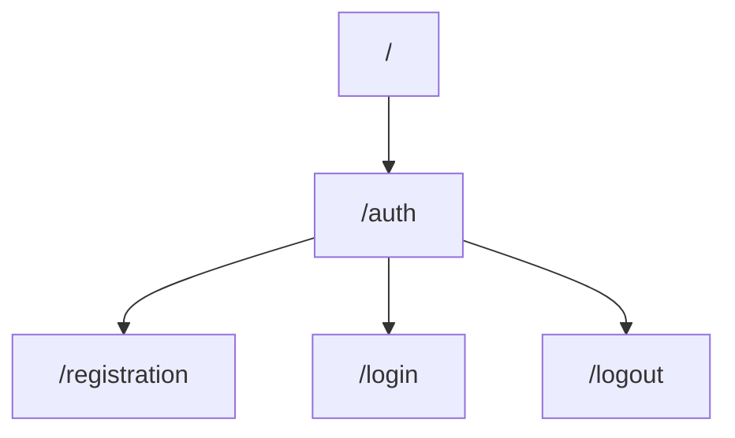

# About

This is a backend REST-API authentication and authorization template written on NestJS.

## Installation
     1) git clone https://github.com/jadegnew/auth_nestjs.git
     2) npm install
### **Important**
Make sure to create an .env file in root directory with this content:  

|FIELD|VALUE|
|----------------|-------------------------------|
|POSTGRES_HOST|`DB host`|
|POSTGRES_PORT|`DB port`|
|POSTGRES_USER|`DB username`|
|POSTGRES_PASSWORD|`DB password`|
|POSTGRES_DB|`DB name`|
|HOST|`Server host`|
|PORT|`Server port`|
|JWT_SECRET|`Your secret key`|
|JWT_EXPIRATION_TIME|`Expiration time of your access token`|

## Current endpoints


### Request examples

 - `@POST`  registration
```go
{ 
	"email": "someemail@gmail.com",
	"username": "somename",
	"password": "somepassword"
}
```

 - `@POST`  login
```go
{ 
	"email": "someemail@gmail.com",
	"password": "somepassword"
}
```

 - `@Get`  logout
 ```go
 Empty body
 ```
 
 # Usage
Please note, that mechanisms to hide password from response are not added yet, so we can see password="" in response. I`ll deal with that later.
## Registration
### Registration  attempt on nonexistent email
![Registration  attempt on nonexistent email](https://lh3.googleusercontent.com/buYyFyNFdajzoPRnT9bIq_-7_jWWGDvdsBWDfFV8TwbHDmAnfJ0vePNoziSVWhZGBfABsCTB_O1qbzcNTlJfD5KWB0WD9KrC9yAR_JDZgdrXOspraTZq7RGLt7xYeRRCF_pkbZN9zKtxzgRbhxrX6nhXedqKfsbCdf_RFOp3FGfTGZasjjYQG85JKTEiAEeAhDuzaPuzpyksZCd1A2z38xz9ZMz1VyP5W5z9UBZ5KiQfK4FaWwDC13qQQ9Be2mppc5RZwu_tb1Skvq-AiRC3Ym8JoLeKl7Ns8Ac2nRl3mECtIT89MbtInrk1IRDjAHAo56gQpCMCcwgoYeDQq3ePiEmfmhpfclLVlk9Io6ztVwX84P46aAV9gWhlYAoogLtQ64vnJqUwR0W-Bh-_rbgUF1MBdqfqeREAUdnaJDYyYRMcWxOUQ0vE94jpEwzneYpAkmPc7GdXx1BbEJQwH4SPufKGewdSCfLW_TNFFk3Lh4huZC54xV4OAig4srmXNUcNCV2oSzHtomYYeh7s63jOJEbDB4_es8HhY_sISu14OvkmWUzdx_q0aZilvAUyg5xl-OHBtOdnBSeKn9oc-ml-DSwpmxaeebkkYCo--5n-xYqJBkpQxYxVgAF6BjBeiqME1LN0yIC9WyXXhfp_lfL1FDPHAn1CQei4gaRNlbfVzCf25uE7KV5p_A-cF50Ifu7qIGxg5BtzaBYhuJUSj7s11lTmrpN_w31WZ4kO1a48EXtD83kzBdAE8clvdrH0RbDEyZODyAKtCe3_esWw5ItgZpAFGFC04JPGyesIOgMPalUdQ8NtouEjdNzItvK_5ENVHvufpUcL5FUqG1-Zx7FbeHm-upxvV_AMl_MIFVQbcBWejKSnGamNfxMP6O9IghQJpPCVln1YBPPJ2xLNCMCMF2juuqFayOJN51ikgzV4I40IGnTcSMyKeDEIAiYDzYrreZG7V9-R0uJsj9NYaFCov3Os_-G4wM77zcPvQi-sfn8IBKs3xjr0kg=w866-h644-no?authuser=2)
### Registration attempt on existing email
![Registration attempt on existing email](https://lh3.googleusercontent.com/8-UE4lJlNkXnM0F3ycX9K1pMJJ4K5vcVUAlizKYddl_88WnQR3yj6lToF5iuBQIfbAz3RMJJD9fjK81ZW7tVaQb-ptuiFnfj3q6JiTSG_xSKSSSNk1uqqOO6nGnScFdEs1WelfmVAUaphkk0t4whXHGaCZkxx6occWUJKLqDxrZUy7MEBVuhFj0YvZGNC8dgB91ghVLtV-ry_xnU6a_694ryX9tw4jlcJ9CcPEAvu8Nh-DmDSJNv8wkAPCKRL66OscDWJnyMdYNanGfzgbfKPgz9JUVdVf9kBNArDp94KBDUspCeo6Zq-pAPiGBkTiresnErlPAJTa_flN2nQqTXD7rbx0By1e2GDGbwkUHSwVaNABSz5JxSPFpB7y7S0Y8Vwppdf9WaHlE1gg9f0Qh9m-QXqnkMVCDa6KuIQ0I8IK5GoeB8zbVy8sJCLdErcYbUy-UMz5-XcO4nnRnh-Fgnde8QOv7uO5-B5AgeO27aKgmRmiNqs6Ukx_z8vLWTfWAI9v7X46UPyN5e3xQi23AKxZVznf6o9_1CE2uvawwUkeiQ9On0ZxCwjap59UyPXgrpg7coSW6q19ysxoqFRjVKYrY7syynuBBq23f46MJSXCqOeMMD2Kt4dduyk8e7Q8B2t-B3P_i0EeqtcFm8sK4Ix2aVlYN6-2tFqTwRkEPqZBhL5xlOBHX5N363o-bKuHVXqUtV25ZmAAOwvRDIxVPACOuUET9SFarjRDpWmAH-s3F-LZhkPmZuN9KZJP46j5IVyKv1Odj6blOllVvoxESRyuRhk66me-UWgMv-H_sctpy3RvwH4t5UvnPgaypdRxA8kk_DPwYi_tDf8ig6oifAPxogi1QTk9izKbuC5SJ_-xzZyFJjmyoYR8YwpMFpUeD5LP8SdlAq1EGoLYNUBOlOE6q7gJWQI4uOWWVgH-RRZW2Zu4L-XbNKUoZM94q2pIOMJBQaOlvAk4vVpnj8vr9G_xEHxfvI4vxS6_YK5XbsRSd5YjZxwMrpwg=w863-h669-no?authuser=2)

## Login
### Login attempt with correct data![Login attempt with correct data](https://lh3.googleusercontent.com/WWHFLlHuOdt99btmigCUHgifheV4e3WwIqRRiSUHERRBoM8IncvN81Sma3w1biBk5Ube7UKUqWHAWqXNSkkEPolyTTYbPUTJi2y3ukFi4DNzs37gnqxQwDbL9e3kNKGkikLi6oD8JUwCtymXWAIzNsZCi2JZE7lNdJgMVEaVune9M2hQ4Gii76oMM93E6YDTg37x8od5J-7UNOUunwVcDKe0VTFxjWiS5qSkbnLXsxXzGHBujAqC9hvU1PClHbA8pg_kjOjHm9rarL0bDUOKKfVKzh5QOX_goYMqF8lmYraM_D3swzVuhbq9FXFeUkZz1O7X-3FUsjAXqZmYBFg0lo2iMTHl5wdAtZ4PWCZ08Cct-9aSF9CYAVyN4jR8fUrSpUwwr82hUmX8Rvi-UA56CVLbyGsMMuTU9ttCC7Pv9u4YQuy8gh8ljtOjmdF3pXCU4uGEJmP7VLpnziJSGq3kB0CRa8xkcGrfxYgxguSmetmDOIdmpML2igeVyrvLWJUWJ1k1uihbf8z2L4R1nV7jPFpTJoOTcK3--qdg7g-2ZHMiK6yz6_Dv__FSxMXxWeFSy3PO5ozRpq72AtZgHh0WjPWrAaBjwTVRL6wz9KPAcpUTjSpbHR_0QnYWxZQt-2h8CwwmIaSlffOxCC_Ah8CCd6IEmytwHiggulz7whYuyhQeXAUEDrOysxapWDR2vZbuqkyHG3ZiWux9eGl5qyhU0Ygu7fidPwCoLSLV30j9fBSPFQ2S2FvL9iGBEcbvHncyMp2ju08RwGhn9eg6DRDW47nLOPQ040wv9HlW_ekTlQecnck72yUQjt_yB8lWaLVHkt1zAHA3neKHBJNdLFSHU_7rs4Fbi7b260RupPNjGQHekroMxzkWFAsSp-RR7jiA8n_sc9UHzTYnuOy2qyXDiiC-NSyPULL5JGICsL4szhgtRXPPnVPTaj7rstFW9M0YpOWWGGjGUfO3zUeXhxJAqTKuKnr60k0o55uQJx2Y9ffQOuq8VGcgDQ=w861-h668-no?authuser=2)
### Login attempt with incorrect data
![Login attempt with incorrect data](https://lh3.googleusercontent.com/KnayOLBavUBWI31AfLNTnz30xdfS34v2MMZ-VhslIhSMo-cAzEkqHy2diE6ZB88NggNLbL3doQWCyxWD7Lc6Ayjuwrrtn7Iqls2BVrUE-eAGD9EQjqMtlOtBQz0JJplYf1SNUqCaDVxAc-tTf0JF8z5hQkqGqnuRF94gKuQgVyoP1loyZt8J4_L1U-T9_P_F_U4lHApKp8sizscF8GI0Hx4EBYxOG3wEapUlLZVo7KJExKOgAyQF8HZY6L0p__jfJ1upBzhsszW3gXPbtOPEuPQlKM3kAnighX9zB_WF6KP2NE9P5O-unTl88LUYtuWRsj4U5AbIPUsmFkPk_lSkoZj_Xru2R3siKdDGPGC8S-mu4WLNL_-odacuz5rNjw-XgfRfWjYHnWNp2ZczZJkkRG9XQ563EtP_KbNA5EBY1Ezqgk6hJ5iijbX549EduuXCsOdTLDGQA9Z9KlaNsAZwmiN-mwDwUBNNyqzExt53gV8dQdkKS6IC8vkh_StS8poKxy3yQkGirsxjqFzdAxOIKAxp4oMSNz220v7TxIZze9ZtzgZoPxNjopI7ryT7pz9HOL4F4TVp_KWZ3NLiXHcWM5QaXeUEdYZzWW08FrxZPEJQ9pl__RGRTzDmkg-HGLoxJnvexewH6Md86NhrxMk0kHQ2AS9IctNKT6fIqa-KDfWB_ODFiL0UBIUW2AVS20BaQxPDhgcv9hSdOo4XAxoHiMs8X1yj22jwGG_4rx-t09ialiNbxUY8aIP1E_dDOCxagK9Tlsl46ndrCc5JhU3OmLeR3Ogui9WcWIoa32A3L1n5yWvyY2Mm7UOMEFJC836roy_DeSwBHUmRVyljks0E5cnqhHJbgAd_FKkffcIXOOFJvhVhej_cQebDvPRR3sLcDDSo0zDLHixfyGSG_DmejkxiC4dlPcUKJ3grIWmyALrq_xpxHrCn_MfPLNr9UQUnhGCHpUtLYi1wzuTkAEhhTX0_R8AyJj_hbP7fqzICyLKe2WCB8TSvPg=w863-h715-no?authuser=2)
## Logout
![Logout](https://lh3.googleusercontent.com/30jvNqTn8AU5WGJFuoypOhaSjHlLYPz7-Kca98u_RNaJZiyC2dsc3t5i33akvBuDJLehSAcKDi0WL_QCoXmIazofGejyuJDbZ8d4soiqZ2xtPToAXPrHVyr7Jhrz5wDSodfbcyf5IHwlMSC1rfEl1J4d8W-DQbCh6shQN8wg73Yv5O_1466tqRklibolSkEC5cI05oJ8dzVM6bdD3MBknjb8L8D8vU1sw5q6i60yMmqQq8qaw1rF21ebMxW4BaX7KzUWCJ7HKWI6idS6fgtMJwz9zVosHLLMYn_hyhO6r03XOlNvNpVk_bMsvvF5INt--eav1LVaa882IRYe0pfp5tagpVPiwCEAW4dH56kYgbekR8QHYGlnXwc9PXdvBVKWh-URs5SXGGkHLGx_VSW65yQb7lXXBosPdci4myqcnbsUG1ERG0CaJLXMOGMTVBja-7lYTTWwf6Z7fTsrpgdd8frP0ZrHjRCAnNJ_ZRBp6n1uZ2kV6GiBP5xlp3uRjqLVJ_HIZvtlIfScZSklbjfq2uDshraycPZWSrIglEvztpWIgAlWEZviulrkJ4UCCOCK6vCHlvbZdOMVow-oEkJGCZI2F0Ov7TI85U6coubvJMilmZKNRTkUwRHGDBZ54Jmm94ssditCqudKl7PY9LnUcG4pT5kwZK2W-B8FnM1oO9QdbwoxRCUQZk-NcxHVZfJMU_RQYxvbysnjg8GxCbaYUGw9llHUDcSSyBdrvPy1I58KfN8o9_OmBF5HjJuxl3zMS9r8ppZt38X9Eg7w7MTYVzFROgo2SD3YrS7Vbe5A8f9lk5-mzwTSiCYTFcrkm_HCHvoMcPArke3RFHf3PfUxhTyBiAp1tGE5C_-TF3TmKOxH05zk9kUo8rK789zkSSSoqNSO-BRz4om68toys-tYlRb6eytjQWFxxKJBM-tRmS1FLJElvDP9y39G_fEOQ3G31vH3EgUprmXS6vDnVwILsAEoC5XvclEBD1wgyXT0HaN3nqTrKqDHtA=w867-h669-no?authuser=2)

# How to use JWT auth guards
To use access token validation in any endpoint that need authorization you might follow this steps:

 - Create controller for the route
 - Add `JwtAuthenticationGuard` to this controller
 - Create the logic you need

### Example:
```
@UseGuards(LocalAuthenticationGuard)
@Get('your-route-here')
somefunc(){
	return 'Success!'
}
```
If user with valid token will send request to this route `JwtAuthenticationGuard` will check validity of users token.

#### Sending a request without token
![Sending a request without token](https://lh3.googleusercontent.com/v2QCVXtWVT4t2Z8SXzcCnrwEvtJz7OisTfQfvDdKFtsnCFpQvWmZ4wO3_GCuZqwYscXJotdGKtBwb6RoX3utI9PnKLeWOfa_koRfoDIBCj3DsthJ12zW5F-jiJud2xidixyo1r3Dw7yMk4VnROmdtH_Tho9_lyanoXMJKCyxS0uwgP3pR8jxJ9bNM5v2v75XB1nRf2VtVXUtP5ip9Zk4-Z66x4pff134bwyZqrSxSJv0ouUCP6Lb3E0HQlrNa55VYvAetPANDRKTFG02ag8eK0vnISOnJgmz3dH6J_HUzH-VMgIl5SsLsHHcb-XnQzrx8rjw8bNx75s8U6n6VbyWVjyXBj-T3ASZ8Q7zbx1htBhMu-g59kqsBtxMHM79kTkNfaVJvx8ZumZpyII8I1HIHbUyu-1-_pMuzgjwo-Flufnem1qmrG9vYXIdL3GBFnRLGPkier8my790IjxMcnlEtZPjn305vn5KZa-DuIak2Ji13rw6ItbxpVpK0T7caipx1mxi1-Z8fFCbq5wuAMs7bnlmwGBxPkE-I2aZZm6DNVPNCVA19UkKbwYN605HJMy70txVrEniUoojlZWKrDYZyUTY-DWnTSrVva5xsXXSSZJ-yGZeWryNXF4MFli2DNMGUoy5NjqLuhmwQL5a77nBUDHVWTZpJlmNx2_D3hz6kUPm93LA30jyA6kExrbVZNC1zl7UsoOPPsFJEPnSuSHNQ5a72RV-cwE8GoQbbgoP8ZhI4rWAK9CHBSF09L71AZMwUuaXIdGj5h5kymOKXx6HC3YOBs5ZXdDY443PLAM4p-JEenli9E_tHrFH2sCROw-S8oZEiSjut_x0S1dIeGL3rN5uAb9tmz-TngfoS4kNulejuyxBarvuQkYqiJIph8RePrRg2_knNoDamuyvQuLEAM0rOtWUtD0QbKaZID9Cmz_p8aboUhhox_0pT1lqQ0RCN1oYS2d352UIeWFnpEffBHkBcr2u46OgCW-GjmsVQltdYx_jUjlCLQ=w862-h667-no?authuser=2)
#### Sending a request with valid token
![Sending a request with valid token](https://lh3.googleusercontent.com/zW7k8UntgD3bYAKGP8lGnL4bLTqSnTSrTXM-jS9X4BEEIhmayhOzyccbpKaFKzv_kUPtnKd0TEXAg92F_La8w66L5XrZAX_KAVfQgLoJ-9R8jHswQDj3m3pUKWFCZjti5f4uFXSTcG8Pvfroi-jsMBvN0EnFWeE951k-cVGcBHr3k-XWZxEp8NtTSyk_WF6YcSyUAQO2CnRBCUetOtA_BI1iugw5P_iDhgDSfBCJt8Aej5WnMXl_fA-8TlfD7EiI1PPv4tgYd585AkP9yQUtDB6Vw3O0va5QqXvAc5IUABTV0r-a8J_Q9YlfLemj0qBJoGZgGWflrtOW7FhvNyTEr1wMe7yRQ_gFF6ciznHUPzulEkMFcFmBWfR1BtjRGbuU03-qQaudDbI75JoBb-i78q1uJdpL7AaxlobBnKgFw8Ii1UiW0h1UDn1mmOnxa0YqabgpLC6ffKpx-qChSq6Ge9wuQh3s6uD9Vug64PkvgBnuj4PlqA8zI482gL126drEDEZAWtZnYoEsCuTKHHTNOYS8RtTOlRMcrTzrGHjQlFb84zXSBZb3VB5-adiR1vhuAWJenJsH2bhpzLzZMOhisaFj8RlJfJMfiq5X9Ix_EIu98jJ_YMV89lyCEKxcplHdRlut6_f81NfEEBX73rYmOlLic9M9zVXbuvWdW0O9prWLfHvsTDC68zrqNLjejESlr7rC3y3GHSgCYroELpgFMrfzvdMahiF9WpAfM8VSKjRuSbTePE6fftdBw_SdpcEzu4FLqLYoM2TBuJIf0NyyPOm3WY4BTvKiC8s4CHXmvIwutpccW0FthL42OSgNoJz934zaj3ivwJhddC1yiHFZ3_CuSglitFbEqDLQ1l21sHRL7PmYev7-Id8udLGGtiLXBJyx70s4eY9y8whTrDpzZLNtn7MUR_l9M6Av35GuKbbAdcY3YmFCnFNRPj2u5pY8gybY_CmasqS-rq1svw3A86nKCaJTXrwuk-6HYkAYtJmbBY8JN8UFEw=w864-h641-no?authuser=2)
