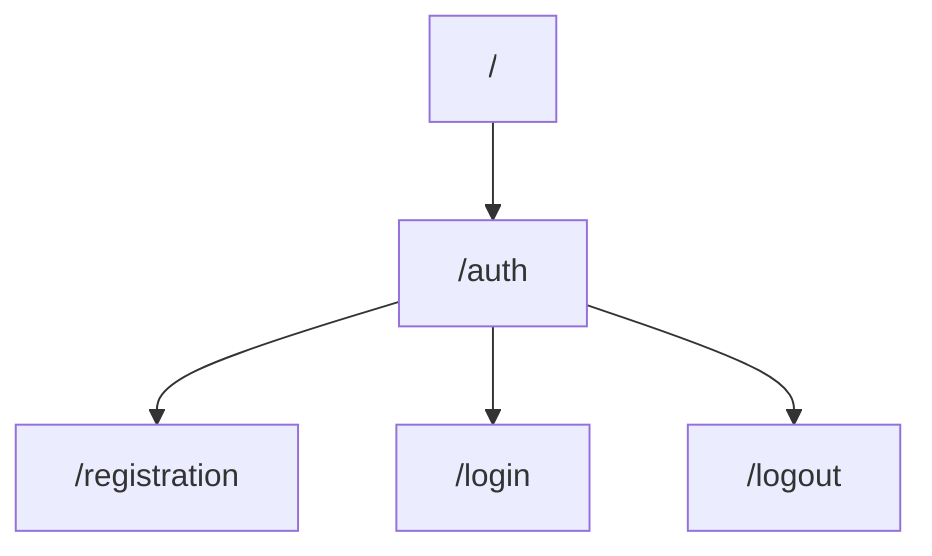

# About

This is a backend REST-API authentication and authorization template written on NestJS.

## Installation
     1) git clone https://github.com/jadegnew/auth_nestjs.git
     2) npm install
### **Important**
Make sure to create an .env file in root directory with this content:  

|FIELD|VALUE|
|----------------|-------------------------------|
|POSTGRES_HOST|`DB host`|
|POSTGRES_PORT|`DB port`|
|POSTGRES_USER|`DB username`|
|POSTGRES_PASSWORD|`DB password`|
|POSTGRES_DB|`DB name`|
|HOST|`Server host`|
|PORT|`Server port`|
|JWT_SECRET|`Your secret key`|
|JWT_EXPIRATION_TIME|`Expiration time of your access token`|

## Current endpoints


### Request examples

 - `@POST`  registration
```go
{ 
	"email": "someemail@gmail.com",
	"username": "somename",
	"password": "somepassword"
 }
```

 - `@POST`  login
```go
{ 
	"email": "someemail@gmail.com",
	"password": "somepassword"
 }
```

 - `@Get`  logout
 ```go
 Empty body
 ```
