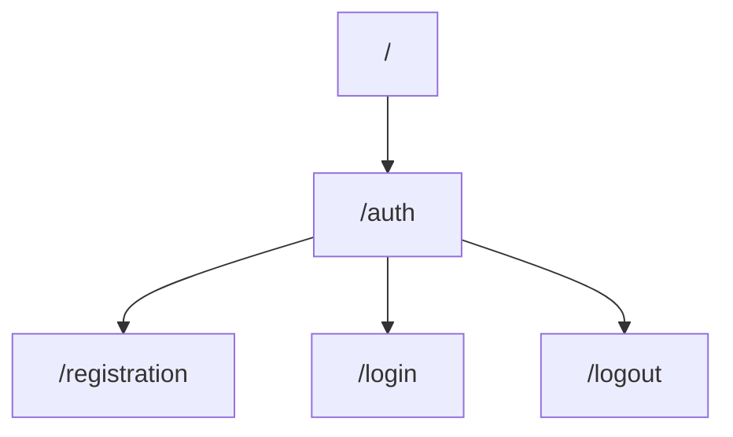

# About

This is a backend REST-API authentication and authorization template written on NestJS.

## Installation
     1) git clone https://github.com/jadegnew/auth_nestjs.git
     2) npm install
### **Important**
Make sure to create an .env file in root directory with this content:  

|FIELD|VALUE|
|----------------|-------------------------------|
|POSTGRES_HOST|`DB host`|
|POSTGRES_PORT|`DB port`|
|POSTGRES_USER|`DB username`|
|POSTGRES_PASSWORD|`DB password`|
|POSTGRES_DB|`DB name`|
|HOST|`Server host`|
|PORT|`Server port`|
|JWT_SECRET|`Your secret key`|
|JWT_EXPIRATION_TIME|`Expiration time of your access token`|

## Current endpoints


### Request examples

 - `@POST`  registration
```go
{ 
	"email": "someemail@gmail.com",
	"username": "somename",
	"password": "somepassword"
}
```

 - `@POST`  login
```go
{ 
	"email": "someemail@gmail.com",
	"password": "somepassword"
}
```

 - `@Get`  logout
 ```go
 Empty body
 ```
 
 # Usage
Please note, that mechanisms to hide password from response are not added yet, so we can see password="" in response. I`ll deal with that later.
## Registration
### Registration  attempt on nonexistent email

### Registration attempt on existing email


## Login
### Login attempt with correct data
### Login attempt with incorrect data

## Logout


# How to use JWT auth guards
To use access token validation in any endpoint that need authorization you might follow this steps:

 - Create controller for the route
 - Add `JwtAuthenticationGuard` to this controller
 - Create the logic you need

### Example:
```
@UseGuards(LocalAuthenticationGuard)
@Get('your-route-here')
somefunc(){
	return 'Success!'
}
```
If user with valid token will send request to this route `JwtAuthenticationGuard` will check validity of users token.

#### Sending a request without token

#### Sending a request with valid token

